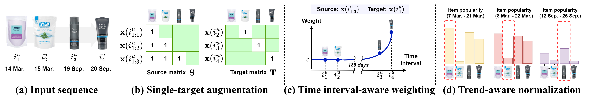

# Temporal Linear Item-Item Model for Sequential Recommendation (WSDM'25)
This is the official code for TALE in the paper "[Temporal Linear Item-Item Model for Sequential Recommendation](https://arxiv.org/pdf/2412.07382)", [The 18th ACM International Conference on Web Search and Data Mining](https://www.wsdm-conference.org/2025/).

## Overview
**TALE** is a novel linear sequential recommendation approach that effectively captures temporal dynamics in user-item interactions. Unlike complex neural models, **TALE** achieves superior performance while maintaining high computational efficiency through its linear item-item formulation.
Our model addresses two key limitations in sequential recommendation:
- **Efficiency**: TALE's linear architecture provides dramatic speedups (up to 57× faster) compared to transformer-based models
- **Temporal modeling**: Unlike existing methods that only consider sequential ordering, TALE leverages actual timestamps to model time-dependent preference shifts

The key innovations of our approach include:
- **Single-target augmentation**: Focuses on a single target item to learn precise temporal correlations
- **Time interval-aware weighting**: Utilizes actual timestamps to model item relationships based on time intervals
- **Trend-aware normalization**: Reflects dynamic changes in item popularity over time




## Requirements
We will update the complete implementation environments soon.

## How to run
```
python run_recbole.py --dataset=beauty --model=TALE --reg_weight=100 --tau_train=0.5 --tau_inf=2
```

## Citation
Please cite our paper if you find our work helpful.
```
@inproceedings{park2025tale,
  title={Temporal Linear Item-Item Model for Sequential Recommendation},
  author={Seongmin Park and
          Mincheol Yoon and
          Minjin Choi and
          Jongwuk Lee},
  booktitle={The 18th ACM International Conference on Web Search and Data Mining (WSDM)},
  year={2025}
}
```
